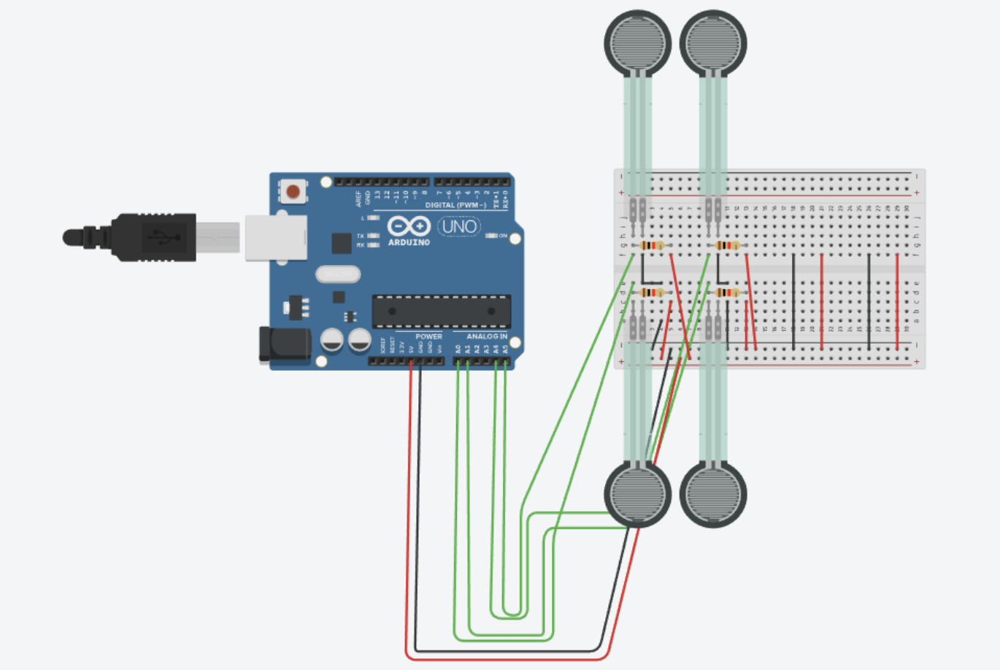
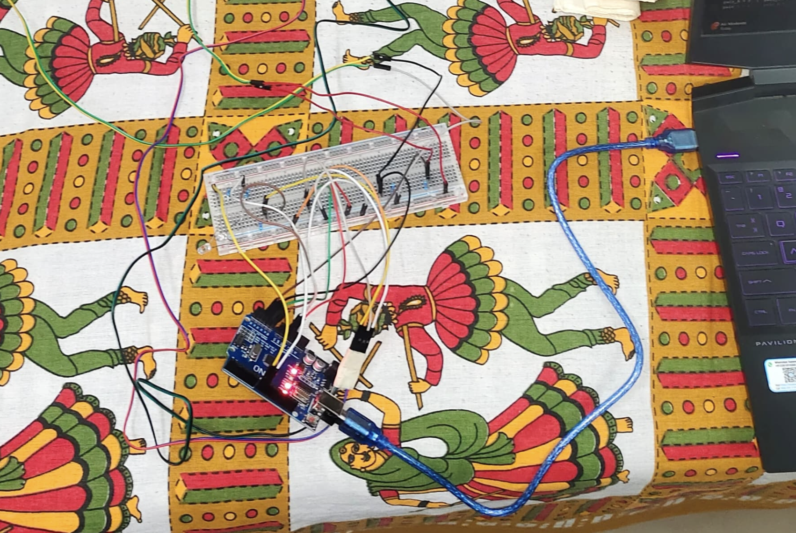

## AR-520 Design Practicum of Mechatronic Systems: Pressure Monitoring Aid for Bedsore Prevention

### 💡 Project Overview

This project presents a **low-cost, real-time pressure monitoring system** designed to prevent bedsores (pressure ulcers) in bedridden or immobile patients. Bedsores develop from continuous pressure reducing blood flow to the skin, leading to tissue damage. Caregivers often often rely on manual repositioning, but pressure hotspots can go unnoticed for hours.

Our solution is a Mechatronic System that actively monitors pressure and alerts caregivers before injury occurs.

### ⭐ Novelty and Key Highlights

The proposed system addresses the limitations of existing solutions by offering:

* **Low-cost, Scalable Solution:** Uses inexpensive FSRs and an Arduino/Bluetooth, making it affordable for various healthcare settings globally.
* **Multi-point Pressure Sensing:** Utilizing 4 FSRs placed at vulnerable points (hips, bum, shoulder) gives a more accurate pressure map than single-sensor systems.
* **Continuous Real-time Monitoring:** The system tracks minute-to-minute pressure changes rather than relying on periodic manual checks.
* **Threshold-based Early Detection:** Automatically detects dangerous pressure levels and duration, which are the two main causes of bedsores.
* **Instant Alert System:** Sends notifications to caregivers before tissue damage begins, enabling early intervention.

### 🎯 Core Features

* **Active Monitoring System:** Provides active monitoring to assure ulcer prevention.
* **Cost-Effective and Accessible:** The system uses sensor-embedded strips that can be placed on *any* regular cushion or mattress.
* **Real-Time Alerting:** An alert is triggered if the measured force exceeds a safe threshold for a specified time limit.
    * *Real-life Safe Limit:* Approximately 7 hours.
    * *Demo Safe Limit:* **10 seconds** (as implemented in the provided code).
* **Automatic Reset:** The monitoring timer automatically resets when the patient is repositioned and the force measured drops.

### 🛠️ System Components and Working Principle

The system uses **Force-Sensitive Resistors (FSRs)** placed at clinically vulnerable pressure points.

#### Working Principle: FSR and Voltage Divider

1.  **Pressure Application:** When pressure is applied to the FSR, its resistance ($R_{fsr}$) decreases significantly.
2.  **Voltage Divider:** The FSR and a fixed pull-down resistor ($R_{pull} = 47 \text{kOhms}$ in the demo) form a **voltage divider circuit**. As $R_{fsr}$ changes due to pressure, the output voltage ($V$) across the pull-down resistor also changes.
    * Low force $\rightarrow$ High $R_{fsr} \rightarrow$ Low voltage ($V$)
    * High force $\rightarrow$ Low $R_{fsr} \rightarrow$ High voltage ($V$)
    * The resistance of the FSR can be calculated as: $R_{fsr}=R_{pull}(V/Vcc-1)$.
3.  **Arduino Analog-to-Digital Conversion (ADC):** The Arduino UNO reads this changing voltage via its analog input pins (A0-A3). The 10-bit ADC converts the input voltage (0–5V) into a digital number between 0 and 1023.
    * 0 V $\rightarrow$ 0
    * 5 V $\rightarrow$ 1023
4.  **Code Reading:** The `analogRead()` function in the code retrieves this 0-1023 value, which is proportional to the applied pressure.

#### Thresholds for Pressure Ulcer Risk (Approximated):

| Pressure (mm Hg) | Risk Level | Approximate Time to Ulcer Development |
| :--- | :--- | :--- |
| 30-40 | Capillary Closure | 4-6 Hours |
| 50-60 | Moderate Risk | 2-3 Hours |
| $>70$ | High Risk | 1-2 Hours |
| $>100$ | Very High Risk | <1 Hour |

### 💻 Core Arduino Logic (`project.ino`)

The provided code implements continuous pressure monitoring logic:

* **Sensor Reading:** Reads analog values from four FSRs (A0, A1, A2, A3).
* **Pressure Detection:** Checks if any FSR reading is above a `THRESHOLD` (set to 10).
    * **LED 1 (Pin 8 - `ledPresence`):** Lights up immediately if pressure is detected.
* **Continuous Pressure Check:**
    * If pressure persists for **10,000 ms (10 seconds)**, the alert is triggered.
    * **LED 2 (Pin 9 - `ledContinuity`):** Lights up to indicate the alert.
* **Reset:** If pressure is lost, the timer is reset, and the alert LED is turned off.

### 👥 Group Contributions

* **Akshat Jha:** Designed the sensing circuit and integrated the FSR sensors with the Arduino to ensure stable and accurate readings.
* **Kusum Agrawal:** Developed and tested the core Arduino logic for pressure monitoring, threshold detection, and alert generation.
* **Harsh Vardhan Saxena:** Configured the microcontroller, handled non-linear behavior (using $t_{response}=max(\frac{1023-ADC_{FSR~sum}}{100},5)ms$), and calibrated sensitivity.
* **Satyawrat Tamrakar:** Managed component logistics and handled the hardware integration by embedding sensors in the cushion and securing wiring and LEDs.